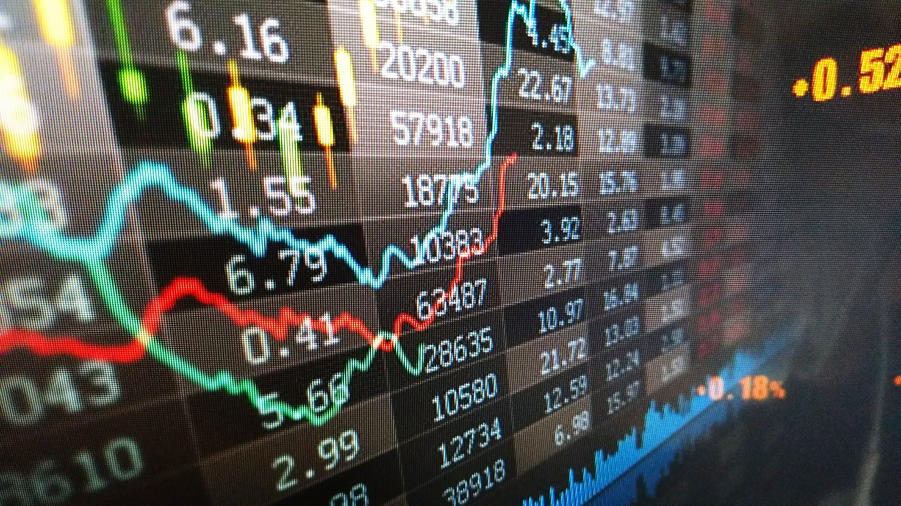

## Stock Price Prediction

The stock market refers to the collection of markets and exchanges where regular activities of buying, selling, and issuance of shares of publicly-held companies take place. Such financial activities are conducted through institutionalized formal exchanges or over-the-counter (OTC) marketplaces which operate under a defined set of regulations. There can be multiple stock trading venues in a country or a region which allow transactions in stocks and other forms of securities.

In this application, I got data from Yahoo Finance. You can check it out [here](https://finance.yahoo.com/most-active).

